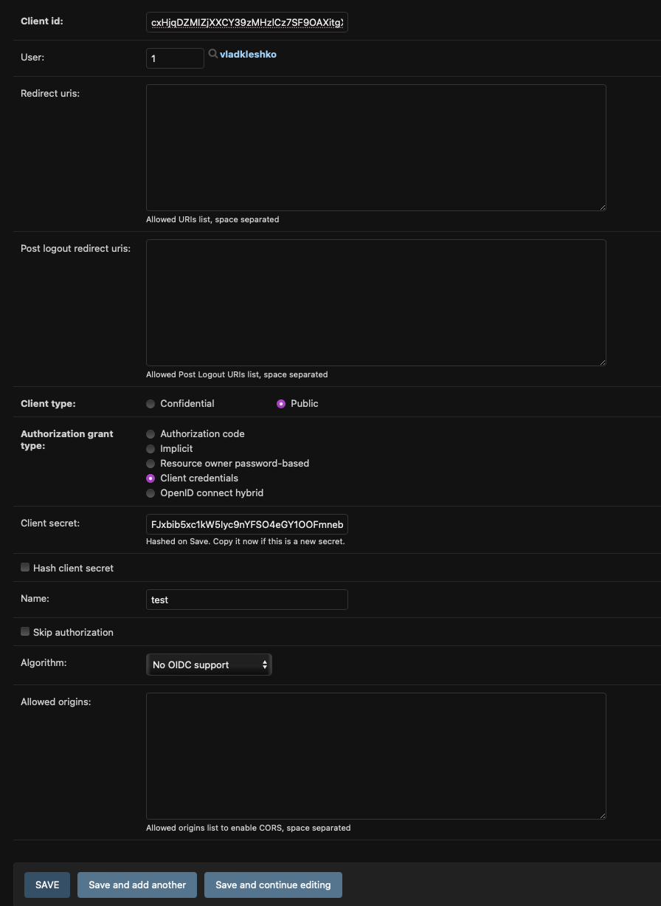
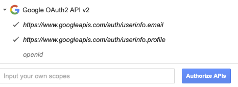
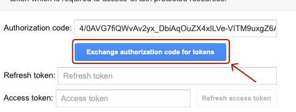
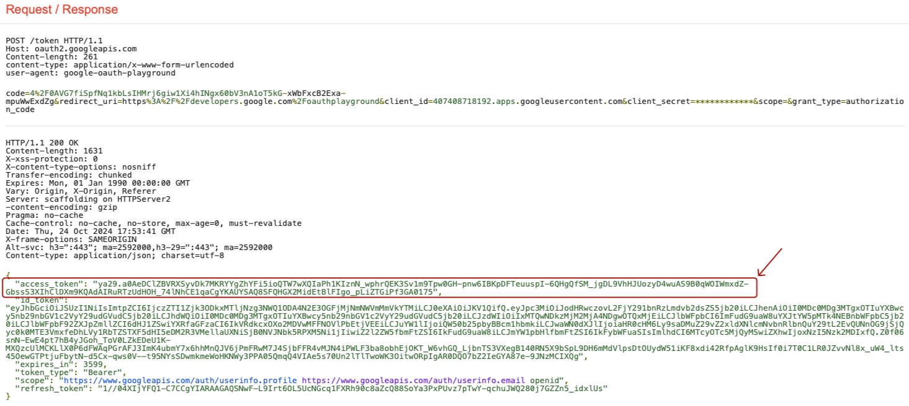

## Installing using GitHub

Клонуємо проект

```bash
  git clone https://github.com/vkleshko/ContactManager.git
```

Встановлюємо залежності

```bash
  pip install -r requirements.txt
```

Налаштовуємо змінні середовища:

```
  set SECRET_KEY=<your secret key> Генеруємо токен тут https://djecrety.ir
  set SOCIAL_AUTH_GOOGLE_OAUTH2_KEY=<твій Client ID>
  set SOCIAL_AUTH_GOOGLE_OAUTH2_SECRET=<твій Client secret>
```
#### Як Отримати <SOCIAL_AUTH_GOOGLE_OAUTH2_KEY> & <SOCIAL_AUTH_GOOGLE_OAUTH2_SECRET>


- Переходимо за цим посиланням (https://console.developers.google.com/apis/credentials)
- Натискаємо "Create Credentials"
- Обираємо "OAuth client ID"
- Application type обираємо "Web application"
- Натискаємо Create після чого ми отримаємо "Client ID" та "Client secret"

Виконуємо Міграції

```bash
  python manage.py migrate
```

## Налаштування нової програми

- Створюємо superuser
- Аутентифікуємось на (http://127.0.0.1:8000/admin/) під superuser
- Створюємо Applications
- Залиште поля client_id і client_secret без змін я назву їх для зручності "django_client_id" i "django_client_secret".
- Встановіть поле user на superuser.
- Залиште поле redirect_uris порожнім.
- Встановіть для поля client_type "Public".
- Установіть для поля authorization_grant_type значення «Client credentials».
- За бажанням ви можете встановити для поля name назву на свій вибір.

#### Скріншот створення нової програми.



### Отримуємо google_token
- Переходимо за цим посиланням (https://developers.google.com/oauthplayground/)
- Обираємо "Google OAuth2 API v2"
- Також обираємо ці два скоупи 'userinfo.email' та 'userinfo.profile'
- Натискаємо "Authorize APIs"
- Обираємо Google аккаунт
- Натискаємо "Exchange authorization code for tokens"
- Тепер ми отримали google_access_token

#### Скріншоти отримання google_token.







Запускаємо сервер

```bash
  python manage.py runserver
```

## Отримуємо Доступ

- Отримати Токен через (http://127.0.0.1:8000/auth/login/)
- За посиланням вище виконуємо POST запит в Postman з ось такими даними
- {\
    "client_id": "<Твій django_client_id>",\
    "grant_type": "convert_token",\
    "client_secret": "<Твій django_client_secret>",\
    "backend": "google-oauth2",\
    "token": "<Твій google_access_token>" \
  }
- Ми отримуємо access_token, тепер ми можемо робити запит до ендпоінтів
